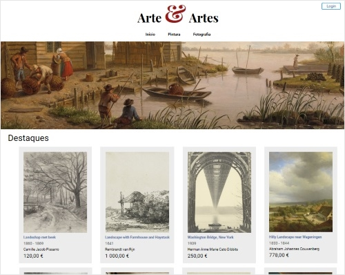
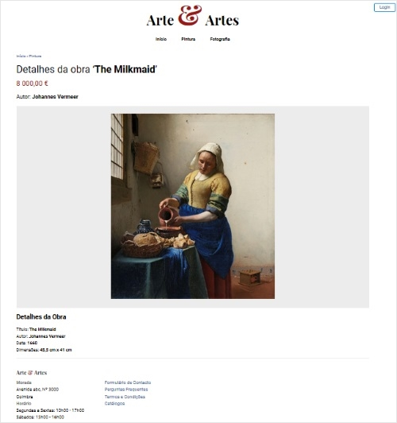
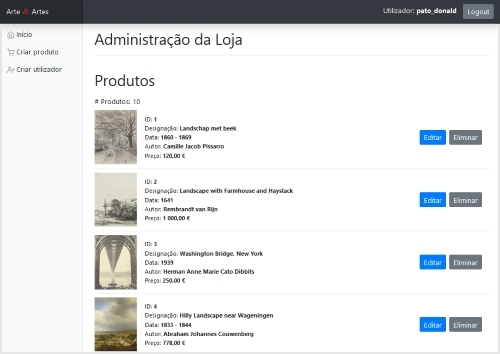
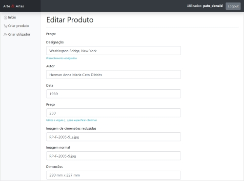
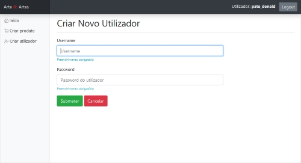

# Website fictício: Galeria Arte & Artes

Website fictício de uma galeria de arte (Arte & Artes), desenvolvido com o propósito de ser um recurso pedagógico, para demonstração da tecnologia ASP.NET Web Pages, bem como para servir de base para a criação de projetos por parte dos alunos.

Este website foi desenvolvido no âmbito da lecionação da disciplina de Sistemas e Programação Web, do curso profissional de Técnico de Multimédia, do ensino secundário.

### **Importante!**

Este website foi desenvolvido com o intuito de demonstrar conceitos de nível introdutório. Como tal, contém **código não otimizado, pouco seguro e que não tira partido da maior parte das funcionalidades que a .NET Framework oferece**.

**Não utilize este website como base para um website real.**

## Descrição

O website é composto por uma página inicial que mostra os produtos vendidos pela galeria de arte:

Ao clicar em qualquer produto, o utilizador pode visualizar detalhes sobre o mesmo:

No canto superior direito encontra-se um link para que o utilizador possa efetuar login.

Existem dois utilizadores pré-definidos:
- Username: **pato_donald** / Password: **123**
- Username: **darth_vader** / Password: **123**

Após efetuar login, o utilizador é redirecionado para uma secção de administração:

Na secção de administração pode:
- criar, editar e eliminar produtos
- criar, editar e eliminar utilizadores

## Utilização

- Clonar o repositório
- Instalar o servidor web [IIS Express](https://www.microsoft.com/en-us/download/details.aspx?id=48264)
- Instalar o [SQL Server Compact Edition](https://www.microsoft.com/en-us/download/details.aspx?id=30709)
- Lançar/executar o website:
	- Opção 1: através do editor [Visual Studio Code](https://code.visualstudio.com/) com a extensão [IIS Express](https://marketplace.visualstudio.com/items?itemName=warren-buckley.iis-express) instalada, ou em alternativa, a extensão [IIS Express executer](https://marketplace.visualstudio.com/items?itemName=Andreabbondanza.iis-express-executer)
	- Opção 2: através do Visual Studio
	- Opção 3: através do Microsoft Web Matrix (foi descontinuado pela Microsoft mas ainda funciona, embora com limitações, podendo ser instalado a partir do [Web Platform Installer](https://www.microsoft.com/web/downloads/platform.aspx))

## Base de dados

Este website utiliza uma base de dados Microsoft SQL Server CE Compact Edition. O ficheiro da base de dados chama-se `arte_e_artes.sfd` e encontra-se na pasta `App_Data`.

A base de dados é propositadamente simples: os produtos encontram-se na tabela `Produtos` e os utilizadores na tabela `Utilizadores`.

## Acerca das imagens e dados utilizados neste website

Todas as imagens e dados das obras de arte foram retirados do website do museu [Rijksmuseum](https://www.rijksmuseum.nl/). As obras encontram-se no domínio público.